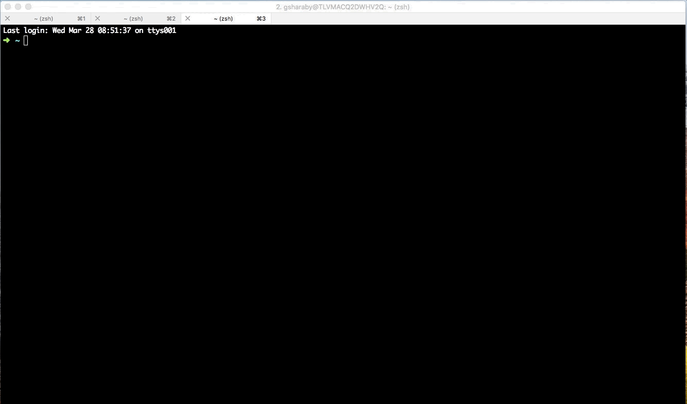
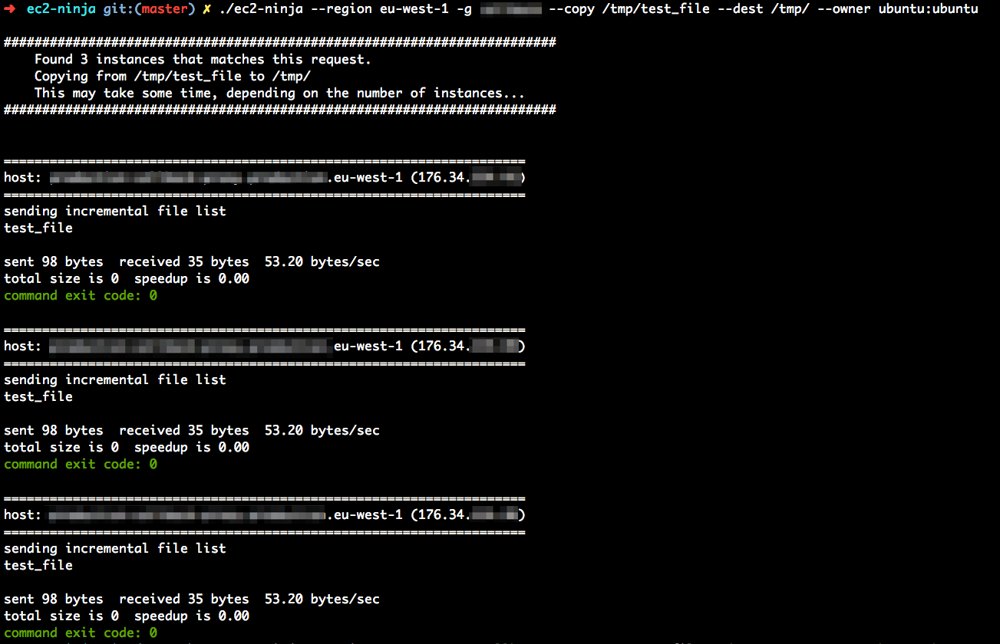
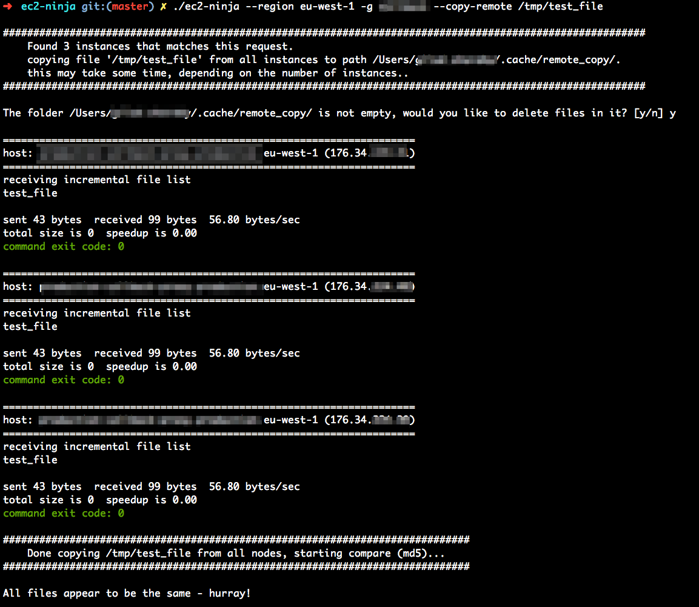
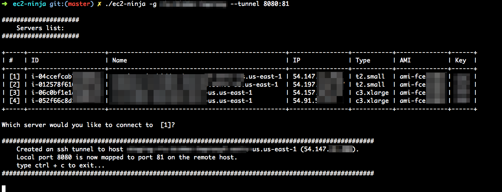

# ec2-ninja
Forked from [ssh2](https://github.com/soheil/ssh2), ec2-ninja is an interactive command line tool which allows you to control your EC2 instances.

in additional to ssh capabilities, ec2-ninja allows you to :
* run ssh commands
* copy file to ec2 instances
* copy files from ec2 instances and compare (md5 check)
* open ssh-tunnel

## Requirements
* [AWS CLI](https://aws.amazon.com/cli/)
* Python
* Python pip
* pip packages (prettytable, PyYAML, boto3) - install with pip install -r requirements.txt

## usage
ec2-ninja has the following flags -

```
Options:
  -h, --help:                         show this help message and exit
  -x, --bust-cache:                   re-fetch servers list from AWS
  -u USER, --user=USER:               provide user
  -i IDENTITY, --identity=IDENTITY:   provide identity file
  -p PROFILE, --profile=PROFILE:      provide AWS profile
  -r REGION, --region=REGION:         provide AWS region
  -b, --bastion                       use a predefined bastion host from conf file
  -g GREP, --grep=GREP:               filter the server list
  --ungrep=UNGREP:                    ungrep - exclude from servers list
  --split:                            open shell panes for each node found - up to 15
  --limit=LIMIT:                      limit the number of panes to open
  -e COMMAND, --exec=COMMAND:         run a single command
  -s SLEEP, --sleep=SLEEP:            sleep between ssh runs, cancel parallel run
  --exit-status=EXIT_CODE:            filter exec exit code outcome - supply 'passed' or 'failed'
  --batch-size=BATCH:                 batch size to run - this is relevant when a sleep is supplied
  --copy=COPY:                        copy a file to remote host, must be supplied with --dest option
  --dest=DEST:                        destination for file copy, must be supplied with the --copy option
  --owner=OWNER:                      change the owner of the file after copying, must be supplied with --copy/--dest option
  --copy-remote=REMOTE:               copy a file from the remote server to local folder
  --dest-remote=REMOTE_DEST:          path to save files from remote-copy (optional, default copy path is ~/.cache)
  --tunnel=TUNNEL:                    ssh tunnel to the instance - provide as <local-port>:<remote-port> or <local-port> only for the same port
  --ip-type=IPTYPE:                   choose between lan and wan address (wan is the default)
  -l, --list:                         show only list (without ssh to instance)
```

## example usage

### split panes:


### list ec2 instances with lan IP:


### execute a command on remote hosts:


### copy a file to remote hosts:


### copy from remote hosts and compare:


### open ssh-tunnel connection (port forwarding):


## config file
ec2-ninja also suuport a config file, which can hold default values.  
the file must be saved as ~/.ec2-ninja.yaml.  
the following options are valid -

```
# ec2-ninja conf file
# This file must be saved as: ~/.ec2-ninja.yaml

default_user: ubuntu # use as default user
default_ip_type: lan # use as default ip type
ignore_cache: yes # always refresh from AWS, don't use local cache file (unless -d option is used)

####  multiple regions per profile ####
# when defined, ec2-ninja will automatically fetch servers from all regions defined
# you can override this default value with the --region option
multi_region:
  default:
    - us-east-1
    - us-west-2
  prod:
    - us-east-1
    - eu-central-1
  qa:
    - us-east-1
    - eu-central-1

####  bastion hosts ####
# for each bastion host, you must define an IP address and user.
# you can also define an additional ssh key (full path), if it's not your in ssh-agent's keychain.
# if a host is found for the current profile and region, it will be automatically used
bastion_hosts:
  prod:
    us-east-1:
      ip: <ip-address>
      user: <user>
    eu-central-1:
      ip: <ip-address>
      user: <user>
```
## Installation
```
git clone https://github.com/giladsh1/ec2-ninja.git
cd ec2-ninja
ln -sf $(pwd)/ec2-ninja /usr/local/bin/
```

## Author
Gilad Sharaby, giladsh1@gmail.com
